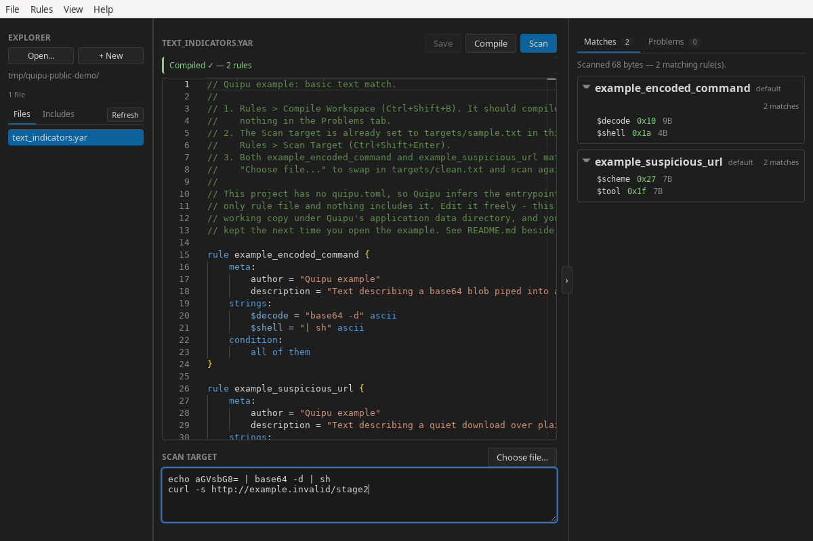

<h1 align="center">
  <br>
  Quipu
</h1>

<p align="center">
  A desktop workbench for writing, validating, compiling, and testing YARA rules.
</p>

<p align="center">
  <a href="https://github.com/corelight/quipu/actions/workflows/ci.yml"></a>
  <a href="https://github.com/corelight/quipu/actions/workflows/codeql.yml"></a>
</p>

Quipu (pronounced “KEE-poo”) brings a project explorer, a YARA-aware editor,
the YARA-X compiler, and focused scan results into one local application. It
embeds both [YARA-X](https://github.com/VirusTotal/yara-x) and its language
server, so you do not need a separate YARA installation.

> [!IMPORTANT]
> Quipu is at MVP stage. Builds target Linux and Windows x86-64.
> Windows desktop validation covers Windows 11 24H2; see the
> [validation record](docs/windows.md#validation-status).
> [Experimental macOS builds](docs/macos.md) have CI coverage and user-confirmed
> build validation; see the [validation record](docs/macos.md#validation-status).



## Features

- Open a folder of `.yar` and `.yara` files as a workspace, or start with a
  scratch rule.
- Explore inferred or configured entrypoints, nested includes, external
  includes, and project problems.
- Edit with Monaco syntax highlighting, completion, hover documentation, and
  live YARA-X diagnostics.
- Compile a complete workspace, then scan typed text or a selected file.
- Inspect matching rules, patterns, offsets, byte lengths, and highlighted
  bytes in a hex viewer.
- Jump from diagnostics and matches directly to their source definitions.
- Restore unchanged compiled rulesets from a bounded local cache.
- Work from a set of small, self-contained example projects included with the
  application.

Rules and scan targets are processed locally. Quipu does not send their
contents to a remote service.

## Install on Linux

Linux x86-64 packages are published on the
[GitHub Releases](https://github.com/corelight/quipu/releases) page:

| Package | Best for | Install or run |
| --- | --- | --- |
| AppImage | Portable use on supported distributions | `chmod +x Quipu_*.AppImage && ./Quipu_*.AppImage` |
| `.deb` | Ubuntu 22.04+ and Debian 12+ | `sudo apt install ./Quipu_*.deb` |
| `.rpm` | Recent Fedora releases | `sudo dnf install ./Quipu-*.rpm` |

The `.deb` and `.rpm` packages use the system WebKitGTK runtime. If your
distribution cannot satisfy that dependency, use the AppImage.

Development packages are available as `quipu-linux-x86_64` artifacts from
successful [CI runs](https://github.com/corelight/quipu/actions/workflows/ci.yml).
CI and Release call the same Linux workflow, including package validation and
native menu smoke tests. The combined `SHA256SUMS` file is supplied by Release,
not by individual CI artifacts.

Quipu packages are not currently signed. Each release includes a
`SHA256SUMS` file; download it beside the packages and verify the files you
downloaded with:

```bash
sha256sum --ignore-missing --check SHA256SUMS
```

The checksums detect accidental corruption but are not an authenticated
signature.

## Install on Windows

For Windows x86-64 packages (v0.3.0 and later), download an installer from
[GitHub Releases](https://github.com/corelight/quipu/releases).
Development builds are also available as `quipu-windows-x86_64` artifacts from
successful [CI runs](https://github.com/corelight/quipu/actions/workflows/ci.yml).

- Use the NSIS `.exe` installer for a current-user installation.
- An MSI `.msi` installer is also available.
- Microsoft Edge WebView2 is required. The installer downloads its bootstrapper
  if the runtime is missing, so installation may need internet access.

The installers are unsigned, so Windows may show an unknown-publisher or
SmartScreen warning. Check that your download came from this repository's
release or workflow before proceeding.

Release packages include a combined `SHA256SUMS` file. In PowerShell, calculate
the hash of your downloaded installer (replace the example filename):

```powershell
Get-FileHash -Algorithm SHA256 .\Quipu_VERSION_x64-setup.exe
Get-Content .\SHA256SUMS
```

Compare the hash with the entry for that exact filename, ignoring letter case.
Individual CI artifacts do not include the combined release checksum file.

If a compiled ruleset is forgotten after restarting, check the bundled guide's
[Windows Defender troubleshooting](documentation/content/preferences-and-cache.md#windows-defender-and-missing-cache-entries).
It explains how to confirm a quarantine and, if needed, exclude only the cache
directory.

## Experimental macOS builds

The CI workflow builds ad-hoc signed DMGs for Apple Silicon and Intel, targeting
macOS 15 or newer. They do not require an Apple Developer membership to build,
but are not notarized and may require a Gatekeeper override to launch.
See [macOS development](docs/macos.md) for CI artifacts, build instructions,
and the current validation status.

## Quick start

1. Start Quipu and choose **File → Open Example… → Basic text match**.
2. Explore `text_indicators.yar` in the editor.
3. Choose **Rules → Compile Workspace** or press
   <kbd>Ctrl</kbd>+<kbd>Shift</kbd>+<kbd>B</kbd>.
4. Scan the prepared target with **Rules → Scan Target** or press
   <kbd>Ctrl</kbd>+<kbd>Shift</kbd>+<kbd>Enter</kbd>.
5. Expand a match and select it to inspect the highlighted bytes.

The full guide is bundled with Quipu under **Help → Documentation**. Its source
is also available in [`documentation/content`](documentation/content).

## Workspaces and `quipu.toml`

Without configuration, Quipu recursively discovers rule files and infers an
entrypoint from each file that is not included by another file. Add a
`quipu.toml` at the workspace root when you need explicit entrypoints, include
directories, or exclusions:

```toml
schema = 1
entrypoints = ["main.yar"]
include_dirs = ["rules", "../shared-rules"]
exclude = ["fixtures/**", "vendor/legacy/**"]
```

See [Workspaces and projects](documentation/content/workspaces.md) for the
complete project model and manifest reference.

## Build from source

All platforms need:

- Rust 1.93 or newer
- Node.js 22.12 or newer
- Zola 0.23.6
- Git

For Windows, follow [Windows development](docs/windows.md) for the MSVC build
tools, Windows SDK, WebView2 runtime, and PowerShell build commands.

For experimental macOS builds, follow [macOS development](docs/macos.md).

Linux also needs the native libraries required by Tauri and WebKitGTK.

On Debian or Ubuntu, install the native dependencies with:

```bash
sudo apt update
sudo apt install -y \
  build-essential \
  curl \
  file \
  libayatana-appindicator3-dev \
  libgtk-3-dev \
  librsvg2-dev \
  libssl-dev \
  libwebkit2gtk-4.1-dev \
  patchelf \
  rpm \
  wget
```

Then build all three Linux package formats:

```bash
git clone https://github.com/corelight/quipu.git
cd quipu/app
npm ci
npm run tauri -- build --bundles appimage,deb,rpm
```

Artifacts are written below `app/src-tauri/target/release/bundle/`. The first
build can take a while because Cargo compiles YARA-X and its dependencies from
source.

Windows build setup, installer behavior, and filesystem limitations are described
in [Windows development](docs/windows.md).

## Develop and test

Install dependencies and start the development application:

```bash
cd app
npm ci
npm run tauri -- dev
```

Run the frontend unit tests, production frontend build, and Rust tests with:

```bash
cd app
npm test
npm run build

cd src-tauri
cargo test --locked
```

The native-menu acceptance suite has additional Linux display-server
requirements. See [`test/README.md`](test/README.md) for its setup and usage.

## Architecture

Quipu is a [Tauri](https://tauri.app/) application with a vanilla TypeScript
frontend and a Rust backend:

- Vite bundles the frontend and Monaco editor into the application webview.
- Tauri IPC connects the UI to workspace, filesystem, compilation, cache, and
  scanning services in Rust.
- The YARA-X compiler and language server run in-process.
- Zola builds an offline documentation site that is embedded in the app.

```text
app/src/           TypeScript frontend
app/src-tauri/     Rust backend and desktop packaging
documentation/    Source for the bundled offline guide
examples/          Projects bundled with the application
test/ui/           Native-menu acceptance test harness
```

The application version is defined in `app/package.json`; Tauri reads that
value when it names packages and reports the running version.

## Current limitations

- Release packages target Linux and Windows x86-64. macOS Apple Silicon and Intel
  builds remain experimental CI artifacts; see the
  [macOS validation record](docs/macos.md#validation-status).
- Quipu scans one selected file or one text buffer at a time, not directories
  or batches.
- New rules are created at the workspace root. Move and delete operations are
  performed outside Quipu.
- A scratch rule can be compiled and scanned, but not saved or cached.

## Contributing and security

Contributions are welcome. Read [`CONTRIBUTING.md`](CONTRIBUTING.md) before
opening a pull request.

Please do not report security vulnerabilities in a public issue. Follow the
private reporting process in [`SECURITY.md`](SECURITY.md).

## Acknowledgements

Quipu is built by [Corelight](https://corelight.com/) and powered by
[YARA-X](https://virustotal.github.io/yara-x/),
[Monaco Editor](https://microsoft.github.io/monaco-editor/), and
[Tauri](https://tauri.app/).

## License

Quipu is distributed under the 3-clause BSD license. See [`LICENSE`](LICENSE).
Notices for software incorporated from third parties are in
[`THIRD_PARTY_LICENSES`](THIRD_PARTY_LICENSES/).
